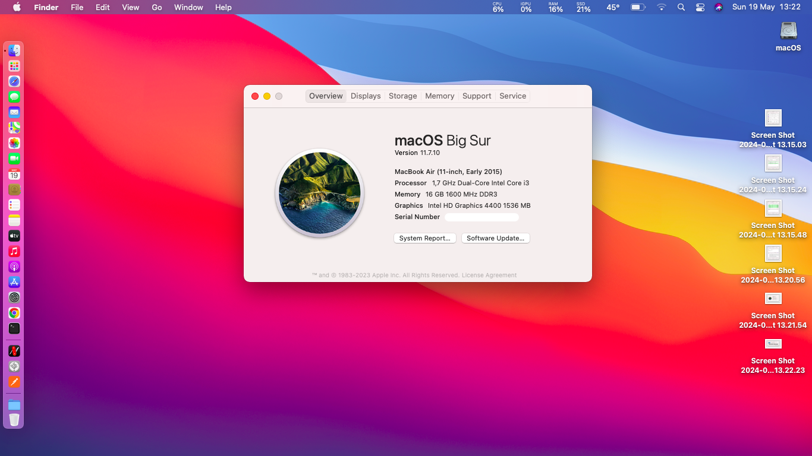
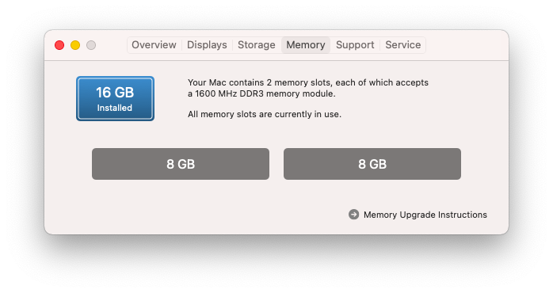
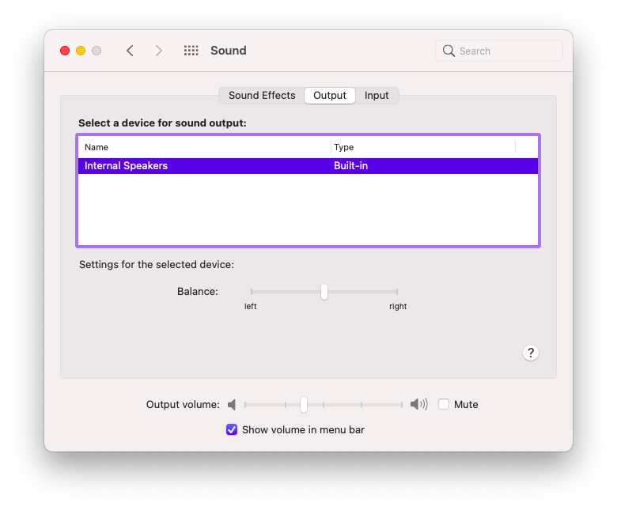
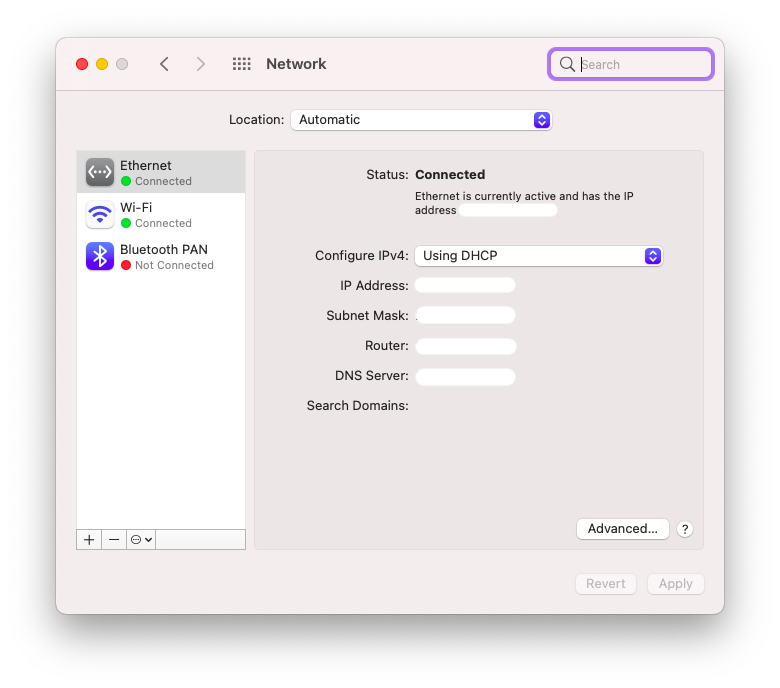
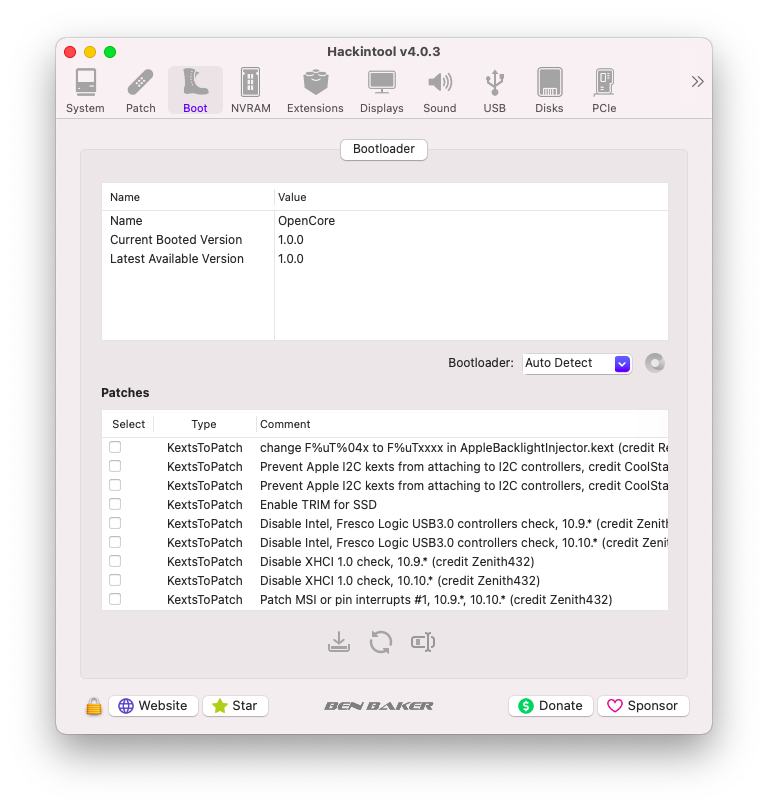

[Português Brasileiro](https://github.com/Gilberto-Mascena/Laptop-Acer-E1-572/blob/main/README-pt_br.md) | 
[English](https://github.com/Gilberto-Mascena/Laptop-Acer-E1-572/blob/main/README.md)

# *EFI OC Laptop-Acer-E1-572-6_BR471*

---

## *Sistemas operacionais*

  
   
     

  

---

_**Minha configuração**_

 - _**Notebook**_
   - [*ACER E1-572-6_BR471*](https://www.acer.com/br-pt/support?search=40545129395;NX.MEVAL.019;E1-572&filter=global_download)
 - _**Versão de Bios**_
   - *v2.17*
 - _**CPU**_
   - *Core I3 4010U*
 - _**GPU**_
   - *Intel HD Graphics 4400*
 - _**Memória**_
   - *2x8GB 16GB*
 - _**SSD Sata**_
   - *Kingston SA400S37 120GB SATA3 2.5 SSD*
 - _**WI-FI / Bluetooth**_
   - *Atheros AR9565*
>[!NOTE]  
> _Não suportado no macOS Monterey_

##
- _**Rede**_
   - *Broadcom NetXtreme BCM57786*

## _Navegação por tópicos_

- [*O que funciona*](#ancora1)
- [*Capturas de telas*](#ancora2)
- [*Kexts usados, (todas releases)*](#ancora3)
- [*Ferramentas recomendadas*](#ancora4)
- [*Configurações de BIOS Intel*](#ancora5)
- [*Agradecimentos*](#ancora6)
- [*Licença* ](#ancora7)

---

<h2>O que funciona 👀</h2>

- [x] *Video (onbord HDMI).*
- [x] *Audio*
- [x] *Rdee*
- [x] *WI-FI*
- [X] *Bluetooth*
- [x] *USB*
- [X] *Sleep*

[Voltar](#ancora)

## Capturas de telas

<h2>Memória 👀</h2>

<h2>Audio 👀</h2>

<h2>Rede e WI-FI 👀</h2>

<h2>Bluetooth 👀</h2>

<h2>Versão do OpenCore 👀</h2>

<h2>Periféricos 👀</h2>

<h2>Mapeamento de portas USB 👀</h2>

[Voltar](#ancora)

<h2>Kexts usados, (todas releases) 👀</h2>

- *[`WhateverGreen.kext`](https://github.com/acidanthera/WhateverGreen)*
- *[`Lilu.kext`](https://github.com/acidanthera/Lilu)*
- *[`VirtualSMC`](https://github.com/acidanthera/VirtualSMC), somente: `VirtualSMC.kext`, `SMCProcessor.kext`, `SMCBatteryManager.kext` e `SMCSuperIO.kext`*.
- *[`IntelMausi.kext`](https://github.com/acidanthera/IntelMausi)*
- *[`CpuTscSync.kext`](https://github.com/acidanthera/CpuTscSync)*
- *[`CPUFriend`](https://github.com/acidanthera/CPUFriend)*
- *`CPUFriendDataProvider.kext`*
- *[`AppleALC.kext`](https://github.com/acidanthera/AppleALC)*
- *`USBMap.kext`*
- *[`RestrictEvents.kext`](https://github.com/acidanthera/RestrictEvents)*
- *[`VoodooPS2Controller.kext`](https://bitbucket.org/RehabMan/os-x-voodoo-ps2-controller/downloads/)*
- *[`RTCMemoryFixup.kext`](https://github.com/acidanthera/RTCMemoryFixup/releases)*
- *[`AppleBCM57XXEthernet.kext`](https://github.com/unitedastronomer/AppleBCM57XXEthernet/releases/tag/Kext1)*
- *[`AirPortAtheros40-AR9565`](https://github.com/qiqco/Atheros-Wi-Fi-Hackintosh-macOS/blob/main/AirPortAtheros40-AR9565.zip)*
- *[`HS80211Family.kext`](https://github.com/qiqco/Atheros-Wi-Fi-Hackintosh-macOS/blob/main/HS80211Family.kext.zip)*

[Voltar](#ancora)

<h2>Ferramentas recomendadas 👀</h2>

* Recomendação 1
  * *Use [`GenSMBIOS`](https://github.com/corpnewt/GenSMBIOS), para gerar novos seriais para seu SMBIOS a fim de evitar conflitos com iServices*
* Recomendação 2
  * *Use [`ProperTree`](https://github.com/corpnewt/ProperTree), para editar seu config.plist*     
* Recomendação 3
  * *Use [`USBMap`](https://github.com/corpnewt/USBMap), para mapear suas portas USB, a partir do OC 0.9.3, elas podem ser mapeadas com XHCIPortLimit habilitado em config.plist + [`USBInjectAll`](https://github.com/Sniki/OS-X-USB-Inject-All/releases).*
* Recomendação 4
  * *Extraia seu DSDT do Windows*
  * *Use [`SSDTTime`](https://github.com/corpnewt/SSDTTime), para gerar seus patches SSDT*    
* Recomendação 5
  * *Use [`MaciASL`](https://github.com/acidanthera/MaciASL), para compilar seus patches SSDT no mac*

[Voltar](#ancora)

<h2>Configurações de BIOS Intel 👀</h2>

- [*OpenCore Install Guide*](https://dortania.github.io/OpenCore-Install-Guide/config-laptop.plist/haswell.html#intel-bios-settings)

[Voltar](#ancora)

## 👉 [_Criando o instalador do macOS no Windows ou Linux_](https://github.com/Gilberto-Mascena/How-to-create-a-macOS-installer-without-a-Mac)

## *Agradecimentos*

- [*Acidanthera*](https://github.com/acidanthera)
- [*CorpNewt*](https://github.com/corpnewt)
- [*CrisHotpatch*](https://t.me/crishotpatch)
- [*Dortania*](https://dortania.github.io/OpenCore-Install-Guide/config.plist/haswell.html)
- [*Dicas do Mateus*](https://www.youtube.com/c/DicasdoMateus)
- [*Gabriel Luchina*](https://www.youtube.com/c/GabrielLuchina)
- [*unitedastronomer*](https://github.com/unitedastronomer)
- [*qiqco*](https://github.com/qiqco)
- *E outros*

[Voltar](#ancora)

## *Licença*

[*Licença MIT*](LICENSE.md) (*MIT*)

### Gilberto | Dev _2020_ 

[Voltar](#ancora)
