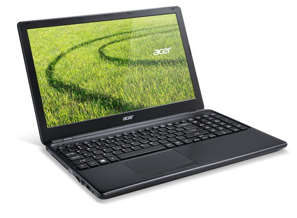

# *EFI OC Laptop-Acer-E1-572 macOS Catalina*

## *Sistema Operacional*

*macOS* | *Catalina*
:---: | :---
  

## *Meu Setup*

*Config* | *Laptop*
:---: | :---
 Placa Mae | ACER E1-572-6_BR471
 CPU | I3 4010U
 GPU | Intel HD Graphics 4400
 Memória Ram | 1x2GB + 1x4GB Total 6GB
 SSD Sata | Kingston SA400S37 120G SATA3 2.5 SSD
 Rede | Broadcom NetXtreme BCM57786
 WI-FI | Atheros AR9565

 ## *O que funciona*

- [x] Video (onbord via HDMI).
- [x] Áudio.
- [x] LAN.
- [x] WI-FI.
- [x] USB.
- [x] Sleep.

 ## *Captura de telas*
 

 ## *Agradecimentos*

- [*Acidanthera*](https://github.com/acidanthera)
- [*Dortania*](https://dortania.github.io/OpenCore-Install-Guide/config.plist/haswell.html)
- [*Dicas do Mateus*](https://www.youtube.com/c/DicasdoMateus)
- [*CrisHotpatch*](https://t.me/crishotpatch)
- [*Gabriel Luchina*](https://www.youtube.com/c/GabrielLuchina)

## *Licença*

*The* [*MIT License*](https://github.com/Gilberto-Mascena/Laptop-Acer-E1-572/blob/main/LICENSE.md) (*MIT*)

*Copyright :copyright: 2020* 
