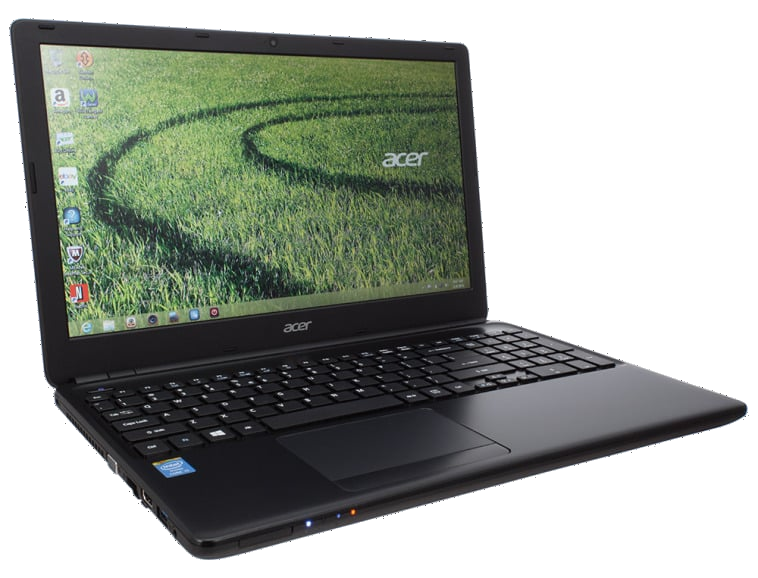

# *EFI OC Laptop-Acer-E1-572-6_BR471*

---

## *Operating systems*

  

  

---

_**My Setup**_

 - _**Notebook**_
   - [*ACER E1-572-6_BR471*](https://www.acer.com/br-pt/support?search=40545129395;NX.MEVAL.019;E1-572&filter=global_download)
 - _**CPU**_
   - *Core I3 4010U*
 - _**GPU**_
   - *Intel HD Graphics 4400*
 - _**Memory**_
   - *2x8GB 16GB*
 - _**SSD Sata**_
   - *Kingston SA400S37 120GB SATA3 2.5 SSD*
 - _**WI-FI / Bluetooth**_
   - *Atheros AR9565*
>[!WARNING]  
> _Not supported on macOS Monterey_ 

##
 - _**Network**_
   - *Broadcom NetXtreme BCM57786*

## _Topic navigation_
- [*What works*](#ancora1)
- [*Screenshot*](#ancora2)
- [*Kexts used, (all Releases)*](#ancora3)
- [*Recommended tools*](#ancora4)
- [*Intel BIOS Settings*](#ancora5)
- [*Thanks*](#ancora6)
- [*License* ](#ancora7)

---

<h2>What works</h2>

- [x] *Video (onbord HDMI).*
- [x] *Sound*
- [x] *Network*
- [x] *WI-FI*
- [X] *Bluetooth*
- [x] *USB*
- [X] *Sleep*

[Top](#ancora)

## Screenshots

<h2>Memory (Upgraded to 16GB)</h2>

<h2>Sound</h2>

<h2>Network and WI-FI</h2>

<h2>Bluetooth</h2>

<h2>Opencore version</h2>

<h2>Hackintool peripherals</h2>

<h2>USB port mapping</h2>

[Top](#ancora)

<h2>Kexts used, (all Releases)</h2>

- *[`WhateverGreen.kext`](https://github.com/acidanthera/WhateverGreen)*
- *[`Lilu.kext`](https://github.com/acidanthera/Lilu)*
- *[`VirtualSMC`](https://github.com/acidanthera/VirtualSMC), only: `VirtualSMC.kext`, `SMCProcessor.kext`, `SMCBatteryManager.kext` and `SMCSuperIO.kext`*.
- *[`IntelMausi.kext`](https://github.com/acidanthera/IntelMausi)*
- *[`CpuTscSync.kext`](https://github.com/acidanthera/CpuTscSync)*
- *[`CPUFriend`](https://github.com/acidanthera/CPUFriend)*
- *`CPUFriendDataProvider.kext`*
- *[`AppleALC.kext`](https://github.com/acidanthera/AppleALC)*
- *`USBMap.kext`*
- *[`RestrictEvents.kext`](https://github.com/acidanthera/RestrictEvents)*
- *[`VoodooPS2Controller.kext`](https://bitbucket.org/RehabMan/os-x-voodoo-ps2-controller/downloads/)*
- *[`RTCMemoryFixup.kext`](https://github.com/acidanthera/RTCMemoryFixup/releases)*
- *[`AppleBCM57XXEthernet.kext`](https://github.com/unitedastronomer/AppleBCM57XXEthernet/releases/tag/Kext1)*
- *[`AirPortAtheros40-AR9565`](https://github.com/qiqco/Atheros-Wi-Fi-Hackintosh-macOS/blob/main/AirPortAtheros40-AR9565.zip)*
- *[`HS80211Family.kext`](https://github.com/qiqco/Atheros-Wi-Fi-Hackintosh-macOS/blob/main/HS80211Family.kext.zip)*

[Top](#ancora)

<h2>Recommended tools</h2>

* Recommendation 1
  * *Use [`GenSMBIOS`](https://github.com/corpnewt/GenSMBIOS), to generate new serials for your SMBIOS in order to avoid conflicts with iServices.*
* Recommendation 2
  * *Use [`ProperTree`](https://github.com/corpnewt/ProperTree), to edit your config.plist.*     
* Recommendation 3
  * *Use [`USBMap`](https://github.com/corpnewt/USBMap), to map your USB ports, starting from OC 0.9.3, they can be mapped with XHCIPortLimit enabled in config.plist + [`USBInjectAll`](https://github.com/Sniki/OS-X-USB-Inject-All/releases).*
* Recommendation 4
  * *Extract your DSDT from windows.*
  * *Use [`SSDTTime`](https://github.com/corpnewt/SSDTTime), to generate your SSDT patches.*    
* Recommendation 5
  * *Use [`MaciASL`](https://github.com/acidanthera/MaciASL), to compile your SSDT patches on mac.*

[Top](#ancora)

<h2>Intel BIOS Settings</h2>

- [*OpenCore Install Guide*](https://dortania.github.io/OpenCore-Install-Guide/config-laptop.plist/haswell.html#intel-bios-settings)

[Top](#ancora)

## *Thanks*

- [*Acidanthera*](https://github.com/acidanthera)
- [*CorpNewt*](https://github.com/corpnewt)
- [*CrisHotpatch*](https://t.me/crishotpatch)
- [*Dortania*](https://dortania.github.io/OpenCore-Install-Guide/config.plist/haswell.html)
- [*Dicas do Mateus*](https://www.youtube.com/c/DicasdoMateus)
- [*Gabriel Luchina*](https://www.youtube.com/c/GabrielLuchina)
- [*unitedastronomer*](https://github.com/unitedastronomer)
- [*qiqco*](https://github.com/qiqco)
- *And others*

[Top](#ancora)

## *License*

*The* [*MIT License*](LICENSE.md) (*MIT*)

### Gilberto | Dev _2020_ 

[Top](#ancora)

---